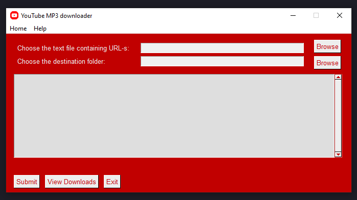
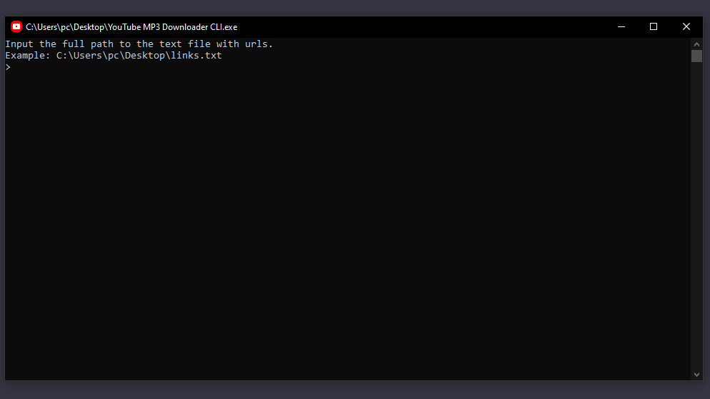

    
    <h2 style="vertical-align: middle; margin: 0;">YouTube MP3 Downloader</h2>

---

YouTube MP3 Downloader is a versatile tool that simplifies the process of downloading audio from YouTube videos in MP3 format. This project includes two versions:

1. `CLI Version` : Designed for quick and effortless audio extraction from YouTube videos using a command-line interface.

2. `GUI Version` : A user-friendly graphical interface that streamlines the downloading process.

You can access each version from its respective branch:

- [CLI Version Branch](https://github.com/Armen-Jean-Andreasian/Youtube-MP3/tree/cli)
- [GUI Version Branch](https://github.com/Armen-Jean-Andreasian/Youtube-MP3/tree/gui)

---

## GUI Version

Screenshots:

**Latest Release: v1.0 - GUI Version**
- Release Date: October 27, 2023
- Author: [Armen-Jean Andreasian](https://github.com/Armen-Jean-Andreasian)

**Overview:**
The YouTube MP3 Downloader is a user-friendly GUI application that simplifies the process of downloading audio from YouTube videos in MP3 format. With this release, we introduce a powerful and convenient way to enjoy your favorite music from YouTube with ease.

**Key Features and Changes:**

- **User-Friendly GUI:** The new graphical user interface makes it easy for users to interact with the application. No need to use the command line anymore.

- **Bulk Download:** Create a text file with multiple video URLs, select the text file, specify the output destination folder, and click "Submit" to download all the videos.

- **Error Handling:** The application provides clear error messages, ensuring a smooth downloading experience. It alerts you if a video is age-restricted and suggests alternative URLs.

- **Automated MP4 to MP3 Conversion:** Automatically converts the downloaded MP4 video files to MP3 audio format, making it convenient to listen to music on the go.

- **Download History:** Keep track of your downloads within the application. The list of downloaded songs is displayed in real-time.

**How to Use:**

1. Create a text file with your video URLs. Each URL should be on a separate line, and URLs should be separated by commas.
2. Open the YouTube MP3 Downloader GUI.
3. Select the text file with the video URLs using the "Choose the text file containing URL-s" button.
4. Choose the destination folder where you want to save the downloaded MP3 files using the "Choose the destination folder" button.
5. Click the "Submit" button to start the download process.
6. Monitor the download progress and check the status in real-time.
7. Once the downloads are complete, you can open the destination folder using the "View Downloads" button.

**Important:**
Age-restricted content cannot be downloaded due to YouTube's restrictions.

**About:**
This application was created by Armen-Jean Andreasian. It's a user-friendly tool designed to make downloading music from YouTube as simple as possible.

[Read the Release details](https://github.com/Armen-Jean-Andreasian/Youtube-MP3/releases/tag/GUI)

[Download YouTube MP3 Downloader GUI v1.0](https://github.com/Armen-Jean-Andreasian/Youtube-MP3/releases/download/GUI/YouTube.MP3.Downloader.GUI.zip)

---

## CLI Version

Screenshot:

**Latest Release: CLI-1.0**
- Release Date: October 26, 2023
- Author: [Armen-Jean Andreasian](https://github.com/Armen-Jean-Andreasian)

The YouTube MP3 Downloader CLI is a command-line tool designed for quick and effortless audio extraction from YouTube videos. This application simplifies the process by enabling users to input a text file containing YouTube video links and specify an output directory for downloaded MP3 files. With just a few simple steps, the YouTube MP3 Downloader CLI automatically fetches and converts the videos into high-quality MP3 audio files, making it a time-saving solution for music enthusiasts.

**Features:**

- Command-line interface for streamlined operation.
- Input a text file containing YouTube video links.
- Specify an output directory for downloaded MP3 files.
- Automatic extraction and conversion of videos to MP3 format.
- Simple and efficient way to build a local music library.
- Ideal for creating playlists or enjoying music offline.
- Customizable options to tailor the download process to your preferences.
- Open-source and user-friendly, making it accessible to all.

The YouTube MP3 Downloader CLI is a powerful tool that simplifies the process of building a local music collection. With its easy-to-use interface, it's perfect for those who want to enjoy their favorite YouTube music offline, without the need for complicated software or online converters. Download your music with ease using the YouTube MP3 Downloader CLI.

[Read the Release details](https://github.com/Armen-Jean-Andreasian/Youtube-MP3/releases/tag/CLI-1.0)

[Download YouTube MP3 Downloader CLI v1.0](https://github.com/Armen-Jean-Andreasian/Youtube-MP3/releases/download/CLI-1.0/YouTube.MP3.Downloader.CLI.zip)

---
Enjoy your music collection with YouTube MP3 Downloader!
